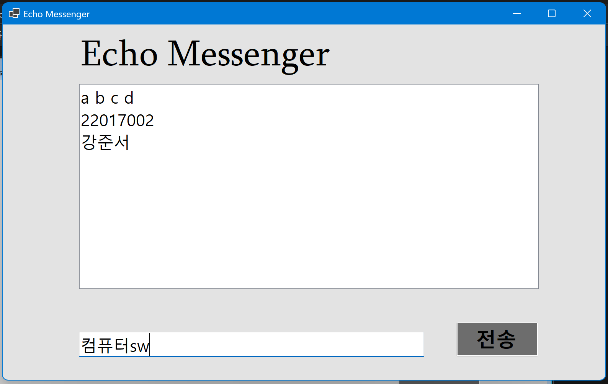
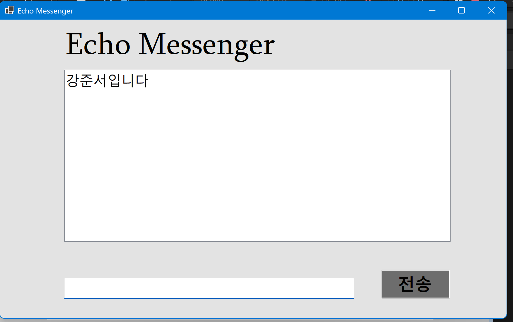
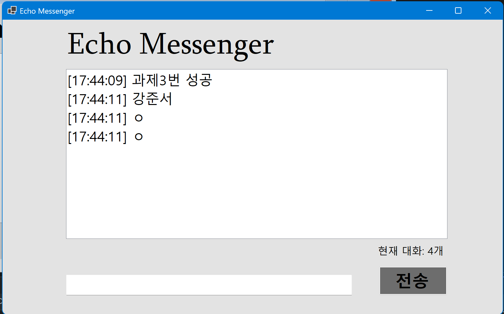
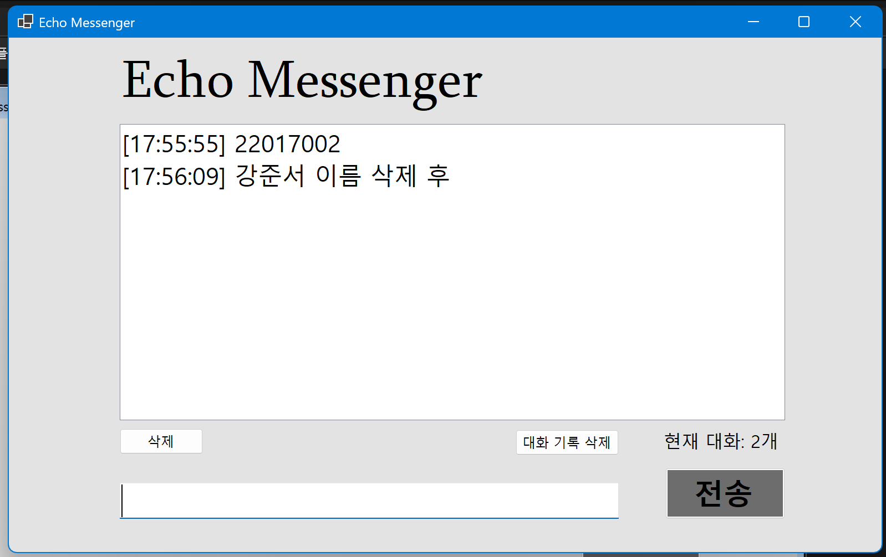
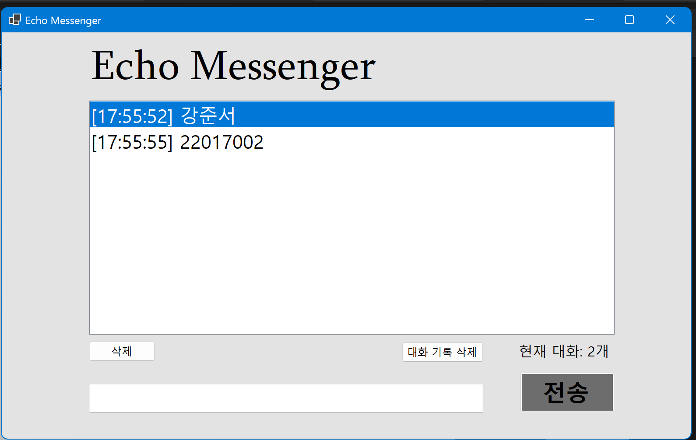
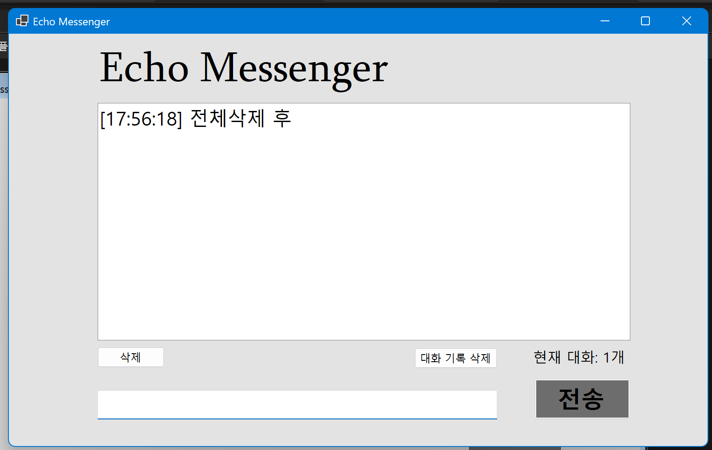

# (C# 코딩) 에코 메신저

## 개요
- C# 프로그래밍 학습을 위해 Windows Forms로 구현한 에코 메신저 프로그램입니다.
- 1줄 소개: 사용자가 입력한 메시지를 받아 리스트에 출력하고, 다양한 편의 기능과 관리 기능을 추가한 프로그램입니다.
- 사용한 플랫폼:
- C#, .NET Windows Forms, Visual Studio, GitHub

- 사용한 컨트롤:
- Label
- TextBox
- ListBox
- Button

- 사용한 기술과 구현한 기능:
- Visual Studio를 이용하여 Windows Forms UI를 설계하였습니다.
- TextBox의 Text 속성을 이용해 사용자 입력을 받아왔습니다.
- ListBox의 Items.Add()를 이용해 메시지를 대화 목록에 추가하였습니다.
- TextBox의 Clear()와 Focus()를 이용해 전송 후 입력창을 정리하고 다시 입력할 수 있도록 구현하였습니다.
- string.IsNullOrWhiteSpace()를 이용하여 빈 문자열이나 공백만 입력한 경우 전송되지 않도록 처리하였습니다.
- Trim()을 이용하여 입력 문자열의 앞뒤 공백을 제거하였습니다.
- DateTime.Now를 이용하여 메시지 앞에 현재 시간을 붙여 출력하였습니다.
- ListBox의 Items.Count를 이용하여 현재 대화 개수를 하단 Label에 표시하였습니다.
- ListBox의 SelectedIndex와 RemoveAt()를 이용하여 선택한 메시지만 삭제할 수 있도록 구현하였습니다.
- ListBox의 Items.Clear()를 이용하여 전체 대화 기록 삭제 기능을 구현하였습니다.
- TextBox의 MaxLength 속성과 문자열 길이 검사를 이용하여 입력 글자 수를 50자로 제한하였습니다.

- 화면 구성:
- 상단에는 프로그램 제목을 보여주는 Label을 배치하였습니다.
- 중앙에는 전송된 메시지가 누적되어 표시되는 ListBox를 배치하였습니다.
- 하단에는 사용자 입력을 위한 TextBox와 전송 버튼, 삭제 버튼, 대화 기록 삭제 버튼을 배치하였습니다.
- 하단 Label에는 현재 대화 개수를 실시간으로 표시하도록 구성하였습니다.

## 실행 화면 (과제1)
- 과제1 코드의 실행 스크린샷

- 과제 내용
- Label(표시), TextBox(입력), Button(전송), ListBox(대화창)를 적절히 배치하였습니다.
- 전송 버튼 클릭 시 TextBox의 텍스트를 ListBox의 항목(Items)으로 추가하도록 구현하였습니다.
- 추가 직후 TextBox의 내용을 비워 다음 입력을 준비하도록 만들었습니다.

- 구현 내용과 기능 설명
- 입력창에 메시지를 입력하고 전송 버튼을 누르면 메시지가 리스트 박스에 표시됩니다.
- 여러 번 전송하면 리스트 박스에 메시지가 한 줄씩 계속 누적됩니다.
- 기본적인 사용자 입력 처리와 UI 배치를 연습할 수 있었습니다.

## 실행 화면 (과제2)
- 과제2 코드의 실행 스크린샷

- 과제 내용
- 전송 후 입력창의 기존 메시지를 자동으로 지우도록 구현하였습니다.
- 전송 후 입력 포커스가 다시 TextBox로 이동하도록 구현하였습니다.
- Enter 키를 눌러도 메시지가 전송되도록 구현하였습니다.
- 빈 문자열이나 공백만 입력했을 때는 메시지가 전송되지 않도록 처리하였습니다.

- 구현 내용과 기능 설명
- 버튼 클릭뿐 아니라 Enter 키로도 메시지를 전송할 수 있어 사용이 더 편리해졌습니다.
- 전송 후 바로 다음 입력이 가능하도록 입력창을 자동으로 초기화하고 포커스를 유지하였습니다.
- 공백 입력을 방지하여 불필요한 빈 메시지가 리스트에 쌓이지 않도록 개선하였습니다.

## 실행 화면 (과제3)
- 과제3 코드의 실행 스크린샷

- 과제 내용
- 전송되는 메시지 앞에 현재 시간을 붙여 출력하도록 구현하였습니다.
- 현재 리스트에 쌓인 총 메시지 개수를 하단 Label에 실시간으로 표시하도록 구현하였습니다.
- 사용자가 입력한 문자열의 앞뒤 공백을 Trim()으로 제거한 뒤 저장하도록 구현하였습니다.

- 구현 내용과 기능 설명
- 메시지가 언제 입력되었는지 확인할 수 있도록 타임스탬프를 추가하였습니다.
- 대화가 몇 개 쌓였는지 즉시 확인할 수 있도록 메시지 개수를 표시하였습니다.
- 문자열 정제를 통해 더 깔끔한 형태로 메시지가 저장되도록 만들었습니다.

## 실행 화면 (과제4)
- 과제4 코드의 실행 스크린샷

- 과제 내용
- ListBox에서 선택한 메시지를 삭제 버튼으로 제거할 수 있도록 구현하였습니다.
- 대화 기록 삭제 버튼을 눌렀을 때 모든 메시지가 한 번에 삭제되도록 구현하였습니다.
- 입력창에 글자 수를 50자로 제한하고, 초과 입력 시 전송이 되지 않도록 처리하였습니다.

- 구현 내용과 기능 설명
- 선택한 메시지만 삭제할 수 있어 특정 대화 기록만 정리할 수 있습니다.
- 전체 삭제 기능을 통해 리스트에 저장된 모든 메시지를 빠르게 초기화할 수 있습니다.
- 입력 길이 제한을 통해 너무 긴 메시지 입력을 방지하였습니다.
- 삭제 기능과 전체 초기화 기능을 추가하면서 데이터 관리 기능까지 확장할 수 있었습니다.

## 배운 내용
- Windows Forms에서 컨트롤을 배치하고 속성을 설정하는 방법을 익힐 수 있었습니다.
- TextBox, ListBox, Label, Button 같은 기본 컨트롤을 직접 다루면서 이벤트 기반 프로그래밍의 흐름을 이해할 수 있었습니다.
- 문자열 처리 메서드인 IsNullOrWhiteSpace(), Trim()을 사용하여 입력값을 검사하고 정리하는 방법을 배웠습니다.
- DateTime.Now를 이용하여 현재 시간을 문자열과 결합하는 방법을 배웠습니다.
- ListBox의 Items, Count, RemoveAt(), Clear() 등을 사용하면서 컬렉션 데이터를 제어하는 방법을 익혔습니다.
- 입력 검증, 예외 상황 처리, 사용자 편의성 개선이 프로그램 완성도에 매우 중요하다는 점을 알게 되었습니다.
- 처음에는 Designer와 Form1.cs의 역할이 헷갈렸지만, 화면 구성과 기능 구현이 분리된다는 점을 이해하면서 구조를 더 잘 파악할 수 있었습니다.
- 직접 기능을 하나씩 추가하면서 단순한 입력 프로그램이 점점 완성도 있는 프로그램으로 발전하는 과정을 경험할 수 있었습니다.